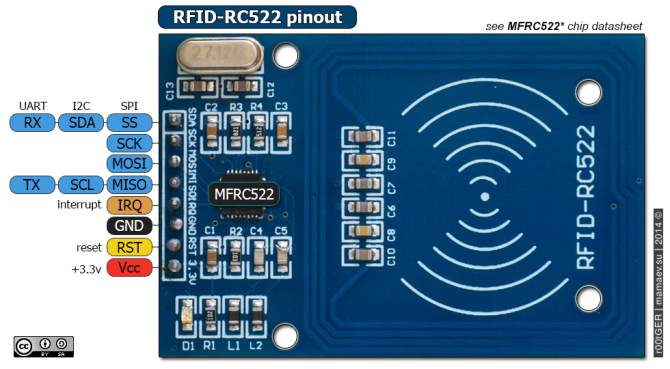
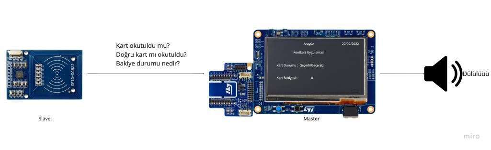

# Giriş
// Proje anlatılacak

# Kaynaklar
// Kullanılacak kaynaklar listelenecek
- STM32 & RC522 : [Bağlantı](https://embeddedexpert.io/?p=768)
- QSPI vs SPI : [Bağlantı](https://www.rfwireless-world.com/Terminology/difference-between-SPI-and-QSPI.html#:~:text=QSPI%20is%20controller%20extension%20to,for%20Queued%20Serial%20Peripheral%20Interface.&text=It%20uses%20data%20queue%20with,data%20transfers%20without%20any%20CPU.&text=In%20addition%20it%20has%20wrap,without%20the%20need%20of%20CPU)
- STM32H750b DK Datasheet : [Bağlantı](https://www.st.com/resource/en/datasheet/stm32h750xb.pdf)
- SPI Nasıl Çalışır : [Bağlantı](https://www.mcu-turkey.com/stm32f0-uygulamalari-spi/#:~:text=Serial%20Peripheral%20Interface%20Bus%20ya,MISO%2C%20SCLK%2C%20CS%20dir)
- STM32HC750 Pinout -> (Resim)
- RC522 Pinout 

# Çalışma Akışı

// Mantık Diyagramı gelecek

// Uygulama Çalışma Şeması

# Elektronik Donanımlar
// RC522
// STM32

# Yazılım Teknolojileri
// TouchGFX
